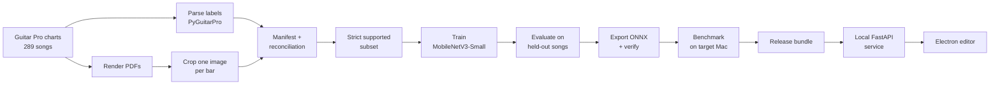

# DrumHub — Drum Score Reader

A private, offline desktop app that reads **drum sheet music** from an image and turns it
into an editable score. Built for young drum students (8–16) and their teachers.

Two halves, deliberately kept apart:

- **The editor** — an Electron + VexFlow 5 score editor you can type drum notation into.
- **The model** — a MobileNetV3-Small optical music recognition (OMR) model trained from
  scratch on 289 real drum charts, served locally through a small FastAPI process.

Everything runs on the machine. No API keys, no uploads, no cloud inference.

**Current release: `baseline-14drum-v1`** — 12.5% of held-out bars read exactly right, 16 ms
per bar on an M1. That is an honest baseline, not a finished product; see
[Results](#results-baseline-14drum-v1).

---

## Contents

- [How it works end to end](#how-it-works-end-to-end)
- [The ML pipeline, step by step](#the-ml-pipeline-step-by-step)
- [The model](#the-model)
- [How it is evaluated](#how-it-is-evaluated)
- [Guards: what stops a bad model from shipping](#guards-what-stops-a-bad-model-from-shipping)
- [Results](#results-baseline-14drum-v1)
- [The editor](#the-editor)
- [The local inference service](#the-local-inference-service)
- [Repository layout](#repository-layout)
- [Running everything](#running-everything)
- [Status and what's next](#status-and-whats-next)

---

## How it works end to end



The training data is not hand-annotated. Each chart is both the **picture** (a rendered
PDF, cropped into one image per bar) and the **answer** (the notes, read out of the same
file with PyGuitarPro). That is what makes 20,000 labelled examples possible for one
person: the labels are a by-product of the source format.

---

## The ML pipeline, step by step

### 1. Labels from the source files

`ml/data-prep/parse/parse_gp5.py` and `parse_gp7.py` read Guitar Pro files and write one
JSON file per bar: which drums are hit, when, and for how long.

### 2. Bar images from rendered PDFs

`ml/data-prep/crop_bars.py` finds the five staff lines and the bar lines in each rendered
page and cuts one PNG per bar. This is ordinary computer vision — line detection and
geometry, no learning — and it was the fiddliest part of the project. Five separate bugs
were found and fixed with regression tests: triplet brackets mistaken for staff lines,
dense 32nd-note beams mistaken for bar lines, narrow repeat bars dropped, wide bars wrapped
across two rows, and miniature final rest bars discarded.

### 3. Reconciliation: prove every label has an image

`ml/data-prep/build_manifest.py` writes `ml/dataset_manifest.csv` (one row per pair, with
its song, source file, bar number, and split) and `ml/data_reconciliation.csv` (every label
**not** in the dataset, with the reason). The point is that no data silently disappears.
Result: 23,660 image/label pairs from 289 songs, with exactly 159 labels excluded — one
song whose exported PDF is blank.

### 4. The strict supported subset

The model's output format cannot express everything drum notation can. Rather than quietly
approximate, `ml/omr/prepare_training.py` **drops any bar it cannot represent exactly** and
records why: 19,942 bars kept, 3,718 excluded (1,324 "play the same as before" bars, 1,287
with an unsupported drum, 815 with an unsupported duration, 500 duplicate onsets, 495 hits
off the grid, 473 bars longer than 4/4 — reasons overlap).

> **ML concept — never silently repair your labels.** The alternative (rounding an
> unsupported duration to the nearest supported one) teaches the model that wrong answers
> are acceptable and quietly inflates your scores. Dropping the bar keeps the training
> signal clean and the exclusion auditable. The cost is stated openly: metrics describe the
> supported subset, not all of drum notation.

### 5. Splitting by song, not by bar

233 train / 28 validation / 28 test **songs**, chosen with a fixed seed (after the subset
exclusions above, 232 / 27 / 28 songs remain, holding 15,839 / 1,919 / 2,184 bars).

> **ML concept — leakage.** Drum notation repeats heavily inside a song: the same groove can
> appear in 40 bars. Splitting randomly by bar would put near-identical bars on both sides
> of the split, and the model would score well by memorising. Splitting by song forces it to
> generalise to music it has never seen. Expect lower, truer numbers.

### 6. Training

See [The model](#the-model).

### 7. Evaluate, export, benchmark, release

Four separate commands, each refusing to run on anything it cannot verify. See
[Guards](#guards-what-stops-a-bad-model-from-shipping).

---

## The model

| Part | Choice |
| --- | --- |
| Backbone | MobileNetV3-Small, pretrained on ImageNet |
| Input | One bar image, greyscale, resized to 128×384, ImageNet-normalised |
| Shared head | Linear(576→1024) + Hardswish + Dropout |
| Drum head | Linear(1024→448) — 32 beat slots × 14 drums, one sigmoid per slot |
| Duration head | Linear(1024→320) — 32 beat slots × 10 duration classes |
| Parameters | 2,305,056 |

> **ML concept — transfer learning.** ImageNet photos are nothing like sheet music, but the
> early layers of a pretrained network already detect edges, lines and corners, which is most
> of what notation is. Starting from those weights instead of random ones is why 16,000
> training images is enough. A small model was chosen on purpose: it has to run on a laptop,
> offline, in milliseconds.

> **ML concept — two heads, two kinds of problem.** "Which drums are hit at this instant" is
> *multi-label*: a kick and a hi-hat can sound together, so every drum gets its own yes/no
> (sigmoid + binary cross-entropy). "How long is this note" is *multi-class*: it is exactly
> one of ten durations, so the ten scores compete (softmax + cross-entropy). Using softmax
> for drums would make simultaneous hits impossible to express.

**Training** (`ml/omr/train.py`, also runnable as a Colab notebook):

- **Phase 1, 15 epochs:** the pretrained backbone is frozen and only the new heads learn
  (lr 3e-4). Freezing includes BatchNorm's running statistics, not just the weights — a
  detail that is easy to miss and quietly wrecks a frozen backbone.
- **Phase 2, 25 epochs:** everything trains at one tenth the learning rate (3e-5), so the
  pretrained features adapt without being destroyed.
- AdamW, cosine learning-rate schedule, batch size 32, seed 42, on the Mac's GPU (MPS).
- **Augmentation** on training images only: small rotations and shifts, brightness and
  contrast jitter, slight blur — imitating a phone photo of a page.
- **Class imbalance:** a kick appears in most bars, a ride bell in a few. Each output is
  weighted by how rare it is (capped at 50×) so rare drums are not ignored. This is a real
  trade-off, and the results show its cost: recall on rare drums is decent, precision is
  poor. See [Results](#results-baseline-14drum-v1).
- **Resumable:** every epoch saves optimiser, scheduler and random-number state, and a resume
  is *refused* if the code, dataset, model, runtime or hyperparameters changed. A run either
  continues exactly or stops.

---

## How it is evaluated

`ml/omr/evaluate.py` scores the saved checkpoint on the 28 test songs, which the model never
saw in training or validation.

| Metric | What it means | Why it is here |
| --- | --- | --- |
| **Sequence accuracy** | The whole bar's ordered note list matches exactly | **The product metric.** The app shows a note list; this scores it the way it is consumed |
| Exact-bar accuracy | All 448 drum slots correct | Strict grid-level view, punishes noise that never reaches the output |
| Cell accuracy | Per-slot correctness | Reads ~97% because most slots are empty. Included *as a warning*, not a headline |
| Duration accuracy at hits | Note length, scored only where a note really is | Separates "found the note" from "got its length right" |
| Per-drum F1 + support + false positives | Per drum, at bar level | Shows *which* drums fail and whether they over- or under-fire |

> **AI eval concept — pick the metric that matches the product, then publish the one that
> flatters you least.** Cell accuracy (96.7%) and sequence accuracy (12.5%) describe the same
> model. Quoting the first would be technically true and actively misleading.

> **AI eval concept — support matters.** A per-class score computed on 6 examples is noise.
> Every table here carries its support count, so "half notes: 0.000" reads as "6 examples,
> ignore" rather than a headline failure.

Everything is written to `eval_results.json` with the checkpoint hash, the dataset hashes,
the metric definitions, and the platform, so a number can always be traced to the artifact
that produced it.

**Other checks in the same spirit**

- **Quantisation is measured, not assumed.** The benchmark compares the int8 build against
  fp32 by *decoded note list*, not by average slot agreement — two models that both predict
  silence agree 100% of the time and mean nothing. It also refuses to report the comparison
  as meaningful when too few bars produced any notes.
- **The editor's drum list is tested against the model's.** A unit test reads the drum names
  out of `ml/omr/training_contract.py`, so the UI and the model cannot drift apart silently.
- **Conversion is tested on fixtures**, including rounding of triplets, rests recovered from
  gaps, and malformed model output.

---

## Guards: what stops a bad model from shipping

The release path is four commands, and each one refuses rather than guesses. These guards
exist because the previous model *did* ship broken: a 284 KB ONNX file — a thirtieth of its
proper size — sat in the repo alongside metrics from a different, 19-drum model.

| Guard | What it catches |
| --- | --- |
| Smoke-run rejection | A two-batch rehearsal can never be published as a release |
| Completion marker + checkpoint hash | Evaluating a half-trained or swapped checkpoint |
| Dataset/model/code hashes in every artifact | Metrics computed on a different dataset than the model trained on |
| Split membership re-verified at eval time | Test songs quietly leaking into training |
| Export size check | The 284 KB export, and any truncated file |
| Export parity check | An ONNX graph that does not compute what PyTorch computes |
| Decision-flip + decoded-bar check | Numerical drift that actually changes a note the user sees |
| Release cross-check | A bundle whose evaluation, export, config and benchmark describe different models |

> **The parity story, as a worked example.** The first export of the trained model *failed*
> its own parity gate: the ONNX output differed from PyTorch by 6.9e-4 against a fixed 1e-4
> tolerance, and nothing was written. Investigation on 96 real bars showed logits spanning
> −23.8 to +7.6 — so 9.7e-4 is about 4 parts in 100,000 of the scale — with **0 of 43,008
> hit/no-hit decisions changed** and **96 of 96 bars decoding identically**. The bug was the
> *tolerance*: a fixed absolute limit passes an untrained model (tiny outputs) and fails a
> trained one for the same relative error. The gate now scales with the model's own output
> size and, more importantly, adds two checks on what the user actually sees: no flipped
> decision, no differently decoded bar.

---

## Results: `baseline-14drum-v1`

Evaluated on **2,184 bars from 28 held-out songs**. Full numbers:
`ml/releases/baseline-14drum-v1/eval_results.json`.

| Metric | Value |
| --- | --- |
| **Sequence accuracy** | **12.5%** |
| Exact-bar accuracy | 12.5% |
| Cell accuracy | 96.7% |
| Duration accuracy (at hits) | 89.7% |
| Bars with at least one predicted note | 1,994 / 2,184 |

**Per-drum F1** (bar-level presence): kick **0.94**, snare **0.88**, closed hi-hat **0.87**,
crash 0.70, side stick 0.65, hi-hat pedal 0.61, ride 0.54, ride bell 0.52, half-open hi-hat
0.51, floor tom 0.39, floor tom 2 0.38, mid tom 0.31, high tom 0.21, open hi-hat 0.11.

**Speed** (M1, onnxruntime 1.27, one thread, one bar per call): fp32 **16.4 ms** median,
39.6 ms p95, 8.80 MB. int8 is 3.7× smaller but slower *and* wrong (0/200 bars decoded
identically), so fp32 ships.

**What the numbers say.** The core kit — kick, snare, closed hi-hat — is read well, and note
lengths are right ~90% of the time. The failure is **over-firing on rare drums**: the model
claims a mid tom in 439 bars that do not contain one, against 115 that do. That is the
direct cost of weighting rare classes heavily during training, and it is what keeps whole-bar
accuracy at 12.5%: one wrong extra drum anywhere spoils the bar.

**The cheapest next experiments**, in order:

1. Tune a per-drum decision threshold on the validation split (no retraining).
2. Lower the rare-class weighting and retrain (~2 hours on the M1).
3. Add more songs — training loss 0.179 against validation 0.404 says the model is
   memorising, and more variety is the real fix.

---

## The editor

Electron + VexFlow 5, plain ES modules, no bundler and no TypeScript.

- All 14 drums the model can read, entered from a numeric keypad (Shift + 0/4/6/9 for the
  four extra drums), including **chords** — several drums on one stem.
- Durations from 32nds to semibreves, dotted notes, rests, and **triplets** (`T`), drawn with
  a proper bracket.
- Stems follow drum-notation convention: hands up, feet and floor toms down.
- Bar capacity is enforced, so an edit can never overflow a 4/4 bar.
- Editing rules live in `js/bar.js` as pure functions (input in, new bar out, no globals),
  which is what makes them testable in Node without a browser.

`js/import.js` turns a model prediction into an editable bar: timing from each hit's
position, overlapping durations shortened, gaps filled with rests, triplets grouped onto
their beat, and every adjustment reported as a plain-English warning for the import screen
to show.

---

## The local inference service

`backend/app.py` — FastAPI, bound to `127.0.0.1` only, loads the ONNX bundle once at start.

- `GET /health` — readiness plus the loaded model's hash and vocabulary.
- `POST /predict` — one PNG/JPEG bar image in, `{position, duration, drums}` notes out.
- Every failure returns one envelope with a specific code (`unsupported_file`,
  `invalid_image`, `file_too_large`, `missing_image`, `invalid_model_output`).
- It refuses to start if the config and model do not match, rather than failing on the first
  request.
- Its preprocessing is **tested to match the training transform exactly**, without PyTorch —
  a mismatch here would silently degrade accuracy in production only.

---

## Repository layout

```
drum score reader/
├── index.html, app.js, js/       Electron score editor (VexFlow 5)
│   ├── bar.js                    pure editing rules (tested in Node)
│   ├── notation.js               drums → staff positions and noteheads
│   └── import.js                 model prediction → editable bar
├── backend/                      local FastAPI + ONNX inference service
├── ml/
│   ├── data-prep/                parsers, bar cropping, spot checks, manifest
│   ├── omr/                      contract, training, evaluation, export,
│   │                             benchmark, release
│   ├── notebooks/                Colab training notebook
│   ├── releases/                 versioned release evidence (JSON, hashes)
│   └── README.md                 model card
├── plan/                         authoritative plan + dated progress audit
└── test/                         Node tests for the editor
```

---

## Running everything

```bash
npm install && npm start                       # the editor
npm test                                       # 46 editor tests

pip install -r backend/requirements.txt
python3 backend/app.py --bundle ml/data/releases/baseline-14drum-v1
python3 -m unittest discover -s backend -p 'test_*.py'   # 16 service tests

python3 -m unittest discover -s ml/omr -p 'test_*.py'    # 35 ML tests
```

Full model pipeline, from charts to a release bundle:

```bash
python3 ml/data-prep/parse/parse_gp5.py        # labels from Guitar Pro files
python3 ml/data-prep/crop_bars.py              # one image per bar
python3 ml/data-prep/build_manifest.py         # manifest + reconciliation
python3 ml/omr/prepare_training.py             # strict supported subset

RUN=ml/data/training/runs/baseline-14drum-v1
python3 -m zipfile -e ml/data/training.zip ml/data/training
python3 -u ml/omr/train.py --device mps --run-dir "$RUN"
python3 ml/omr/evaluate.py --run-dir "$RUN"
python3 ml/omr/export.py   --run-dir "$RUN"
python3 ml/omr/benchmark.py --model "$RUN/omr.onnx" --out "$RUN/benchmark_results.json" \
    --images ml/data/training/dataset/images
python3 ml/omr/release.py  --run-dir "$RUN" --name baseline-14drum-v1
```

Datasets and weights are gitignored; manifests, configs, metrics and hashes are versioned.

---

## Status and what's next

| Area | State |
| --- | --- |
| Data pipeline, reproducible and reconciled | done |
| Model trained, evaluated, exported, benchmarked, released | done |
| Editor: 14 drums, chords, 32nds, triplets | done |
| Local inference service and prediction → bar conversion | done (tested, not yet wired to the UI) |
| Import screen in the app, service lifecycle | next, after a decision on the 12.5% baseline |
| Page/PDF import, playback, PDF/MIDI/MusicXML export | not started |

Longer term (product plan): an AI practice coach with session memory, a retrieval-backed
exercise library, a fine-tuned fill recommender, child-safety guardrails, and a teacher
portal.
